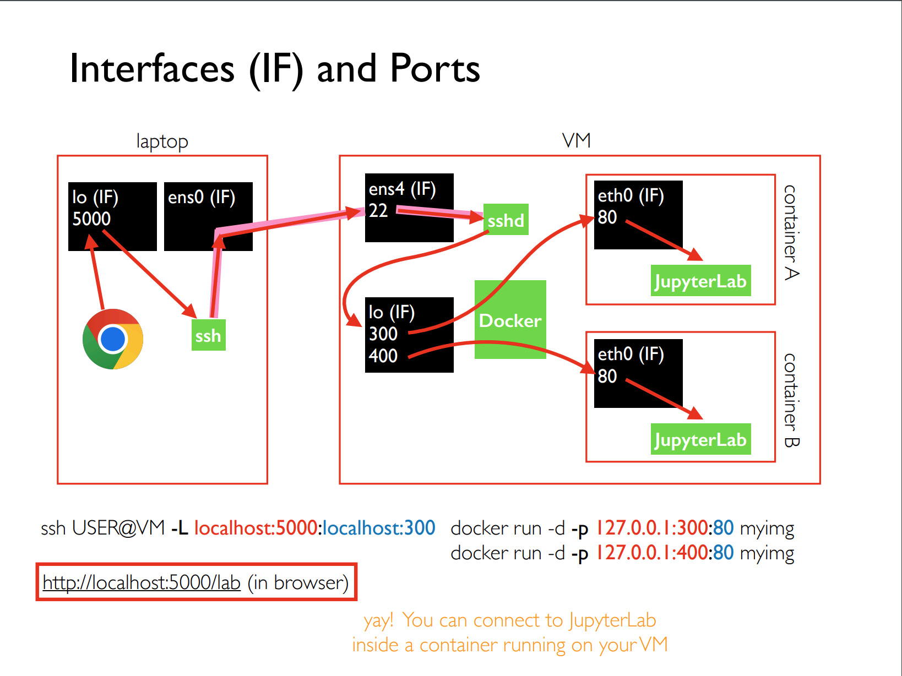
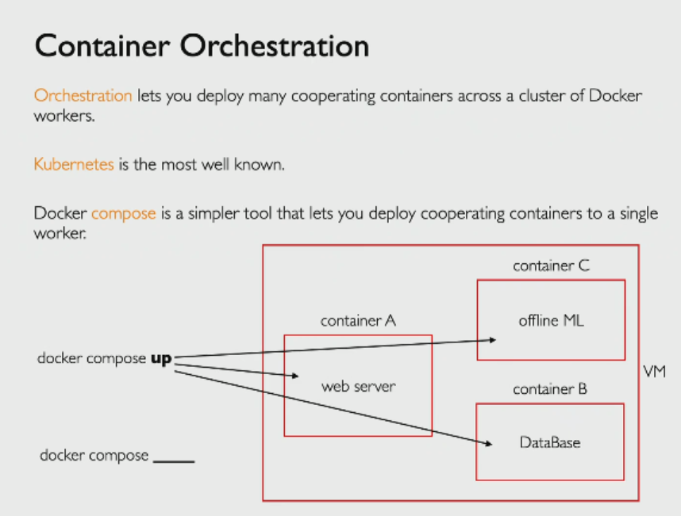

# Docker Compose

https://mediaspace.wisc.edu/media/Tyler%20Caraza-Harter-Noland%20132-10_06_23-13%3A17%3A27/1_bzwkzsdh


## Port forwarding and SSH-tunneling



### SSH-tunneling

`ssh fariha@gcp -L localhost:5440:localhost:300`

### port forwarding

`docker run -d -p 300:80 myimg` forwarding **0.0.0.0**:300 of my host machine to container, which means 
    - Insecureanyone request hitting port 300 in my host machine can access the jupyter notebook running on container.        
    - docker can't forward port to container's loopback network. So, if jupyterlab was running on localhost:80, we can't access it outside container
`docker run -d -p 127.0.0.1:300:80 myimg` is better.

## Container Orchestration



Kubernetes is designed for managing complex, large-scale, and multi-node environments. It offers a high degree of flexibility and scalability. Docker Compose, on the other hand, is simpler and easier to use, but it's primarily designed for development environments and small-scale production deployments.

### Docker Compose Use Cases:

1. create isolated development environments where all the services an application needs can be spun up together.
2. in CI/CD pipelines to build, test, and deploy applications.
3. useful for running multi-container Docker applications, such as microservices, where each service runs in its own container.
4. a great tool for learning about Docker and containerization due to its simplicity and ease of use.


## docker compose cluster

docker-compose.yml file
```docker-compose
services:
  counter_service:
    image: myimg
    ports:
      - 127.0.0.1:5000-5003:5440
    deploy:
      replicas: 3
```

`docker compose` shows lists of available commands

`docker compose up` creates docker containers from `docker-compose.yml` file, blocking

`docker compose up -d` detached

When you run docker-compose up, Docker Compose sets up a single network for your application(s) by default. 
- Each container for a service joins the default network and is both reachable by other containers 
  on that network, and discoverable by them at a hostname identical to the container name.
- Docker Compose sets up DNS for service discovery. This means that services can reach each other 
  by their service name. For example, if you have a service named `web` and another named `db`, 
  web can reach `db` at the hostname `db`.
- Docker uses the 172.17.0.0/16 subnet for container networking by default. In this network, 
  each container will get an internal IP address, starting from 172.17.0.2 and then incrementing 
  for each additional container.
- You can inspect the network to see the exact details by using the `docker network inspect [NETWORK-NAME]` 
  command. First find the network name using `docker network ls`.

`docker compose ps` 

`docker compose down` stops the containers

`docker compose rm` removes stopped containers

`docker-compose logs [CONTAINER-NAME]` access the logs of Docker containers created