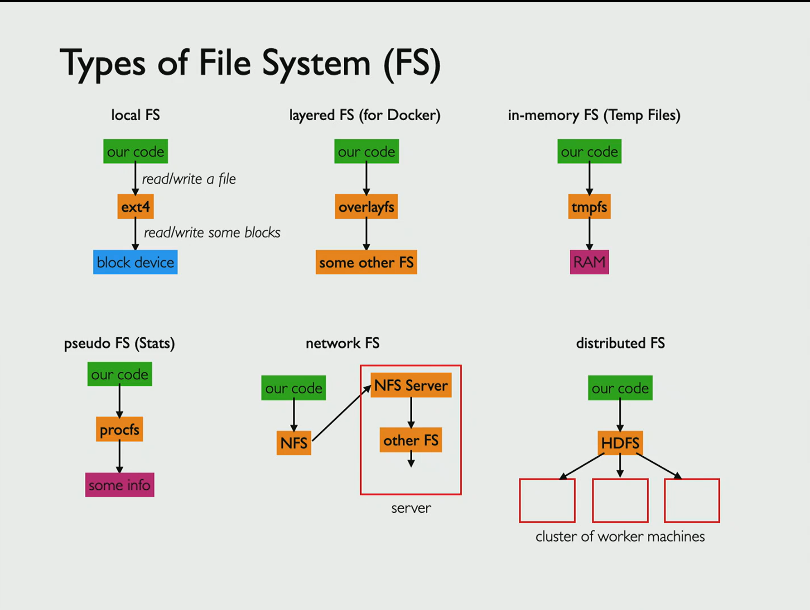

# Storage

block devices

RAID controller

## Types of File System (FS)

1. local FS - `ext4` Fourth Extended File System, used by Linux. 

    Ext4 is a journaled FS, introduced in 2008 and has since become the standard file system for most Linux distributions. Ext4 also supports permissions, encryption, and compression, also file system snapshots. ext4 does not natively support symbolic links or hard links. Instead, Linux uses a separate file system called "procfs" to create symbolic links and hard links. 

2. layered FS (for Docker) - `overlayfs`

3. In-memory FS (Temp Files) - `tmpfs`

4. pseudo FS (Stats) - `procfs`

5. network FS - `NFS`, `AFS`

6. distributed FS - `HDFS` Hadoop FS

"formatting" a drive creates initial structure of a FS, e.g., creating the root directory.

In windows, each drive has its own local FS. 

In Linux, file systems are mounted over directories of other file systems to make one big tree.

$ `mount /dev/sda1 /A` 

$ `mount /dev/sdb1 /B` 

$ `mount`

$ `mount | wc`

$ `df`

$ `df -h`

$ `cd /run` contains tmpfs

$ `cd /proc` contains procfs - contains dir for each process with pid

$ `sleep 100 &`

$ `cd [PID_DIR]`

$ `cat cmdline`

$ `docker run -it -v ./demo:/test ubuntu bash` volume map mounts

